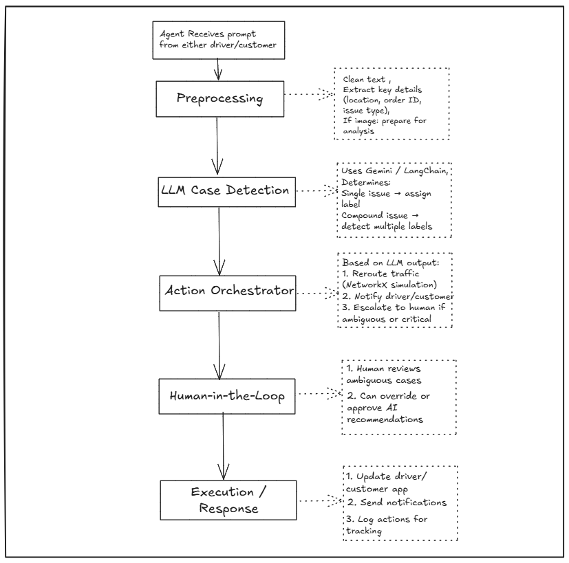

# GrabNavi Submission

## Files
- Synapse/GrabNavi.ipynb: Main notebook with full implementation.
- docs/DESIGN.md: Agent architecture and design.
- docs/PROMPTS.md: Prompt engineering strategies.
- docs/README.md: Quickstart guide.

## Setup
Install dependencies inside Colab or local environment:
bash
!pip install google-generativeai langchain langchain-google-genai networkx pandas pillow


# Run
- Open GrabNavi.ipynb in Jupyter/Colab.
- Execute cells sequentially to run the system.

## Features
- LLM-powered case detection with Gemini.
- Compound case handling (multiple issues in one report).
- NetworkX graph simulation for traffic rerouting.
- Human-in-loop escalation support.

## Folder Structure
```
GrabNavi/
│── docs/
│   ├── DESIGN.md                # Agent design & architecture
│   └── PROMPTS.md             # prompt and its analysis
│   └── image.png                  # flow diagram
│── GrabNavi.ipynb                # Main orchestrator agent
└── README.md
```

# Notes 
- Uses Gemini-1.5-flash API in Google AI Studio.
- For image-based damage cases, upload the relevant image when prompted.
- doc/image.png


# Use Case Diagram


